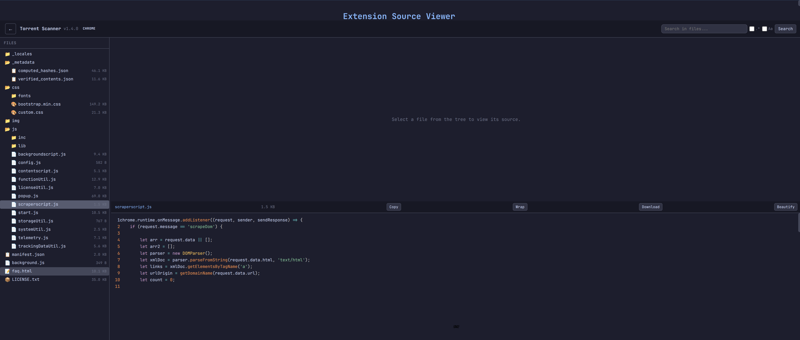

# ExtensionLens

Browse, search, and read source code of any locally installed Chrome extension.



## Features

- **Extension picker** — grid view of all installed extensions with icons, names, and profiles
- **File tree** — collapsible directory tree with file type icons and sizes
- **Syntax highlighting** — JS, CSS, HTML, JSON, Python, Bash via Prism.js
- **Global search** — grep across all files with regex and case-sensitive modes
- **Image preview** — renders PNG, JPG, GIF, SVG, WebP, ICO inline
- **Binary hex dump** — first 1 KB of binary files
- **JSON pretty-print** — auto-formats manifest.json and other JSON files
- **Beautify** — rough-format minified JavaScript for readability
- **Copy / Download / Word wrap** — toolbar actions on every file
- **CRX & ZIP upload** — drag-drop or click to inspect any `.crx` or `.zip`
- **Local only** — binds to `127.0.0.1`, no external connections, no telemetry

## Requirements

- Python 3.8+
- A Chromium-based browser (Chrome, Chromium, etc.)

No pip packages. No npm. No build step.

## Install

```bash
git clone https://github.com/CodeAlexx/ExtensionLens.git
cd ExtensionLens
```

## Run

```bash
python3 server.py
```

Open http://127.0.0.1:8080 in your browser.

## Extension directories scanned

| Browser | Path |
|---------|------|
| Chrome | `~/.config/google-chrome/Default/Extensions/` |
| Chromium | `~/.config/chromium/Default/Extensions/` |

Additional profile directories can be added by editing the `EXTENSION_DIRS` list in `server.py`.

## How it works

```
Python server (http://127.0.0.1:8080)
    ├── /                     Single-page app
    ├── /api/extensions       List installed extensions
    ├── /api/tree?ext=ID      File tree for an extension
    ├── /api/file?path=...    Raw file content (path-traversal protected)
    ├── /api/search?ext=ID&q= Grep across extension files
    ├── /api/upload           Accept .crx/.zip upload
    └── /static/              Frontend assets
```

All file access is validated against known extension directories. Requests for paths outside those directories return 403.

## License

MIT
